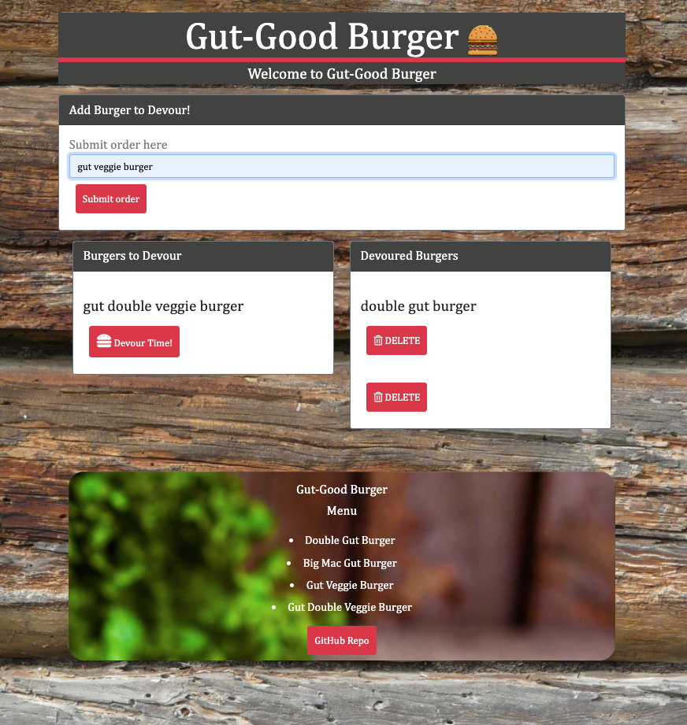
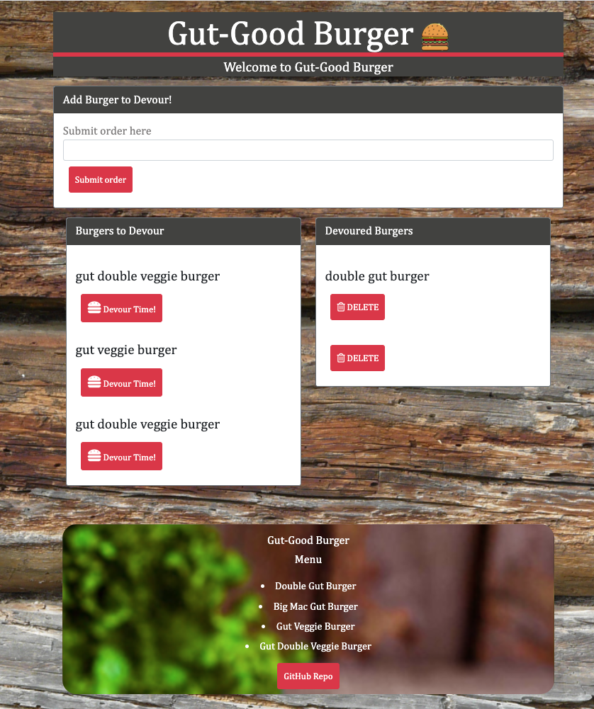
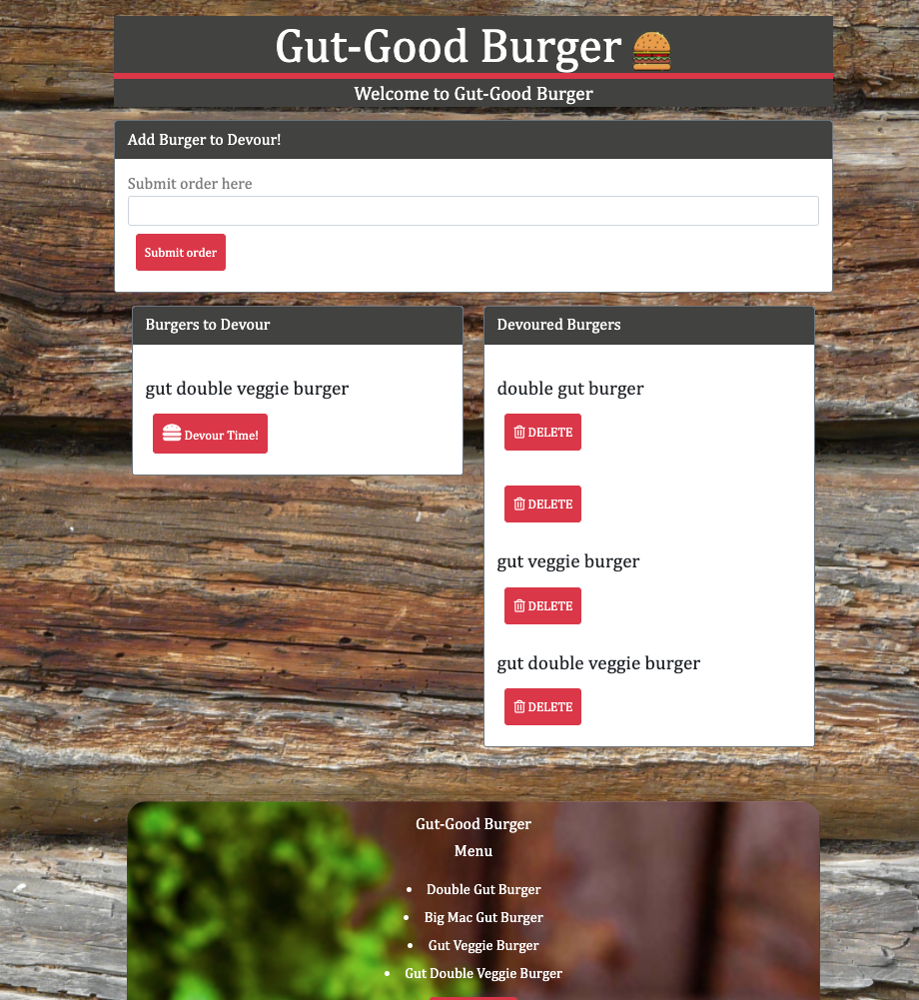
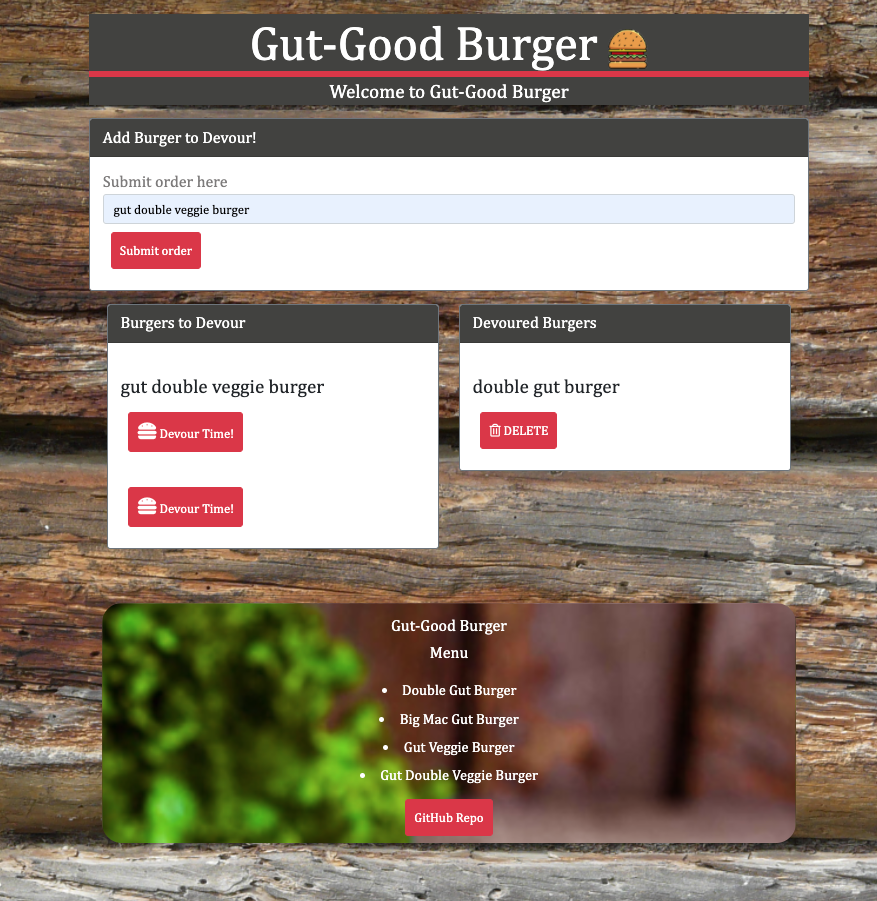

# Der-Gut-Good Burger
 # 
  ## Table of Contents
  * [Description](#description)
  * [Installation](#installation)
  * [Usage](#usage)
  * [License](#license)
  * [Contributors](#contributors)
  * [Test](#test)
  * [Questions](#questions)
  
  ## Description
   This Application is an app that lets user add burger    
   you will devour-eat and the ones you have devoured-delete.    

  ## Installation
  
 Create a GitHub repo called burger and clone it to your computer.

 Make a package.json file by running npm init from the command line.

 Install the Express npm package: npm install express.

 Create a server.js file.

 Install the Handlebars npm package: npm install express-handlebars.

 Install MySQL npm package: npm install mysql.
 
 Require the following npm packages inside of the server.js file:

 express

  ## Usage
  * App reads database to get available burger in the table in order 
    to display them on page.

  * User submits a burger name , the app will display  DEvour burger on 
     left side of the page.

  *  User click the devour button, the burger will move to the right side
     of the page.
 
  * Click delete button then the burger will be deleted from page as well 
    as the database

  ## Lincense
  

  ## Contributors
   N/A  

  ## Test
  
  

  ## Questions

  Contact me:
  Deploy Heroku:https://quiet-scrubland-98672.herokuapp.com/    
  Github: https://github.com/Wendyf02/Der-Burger  
  Email: cammomila444@gmail.com

 

 

 

 